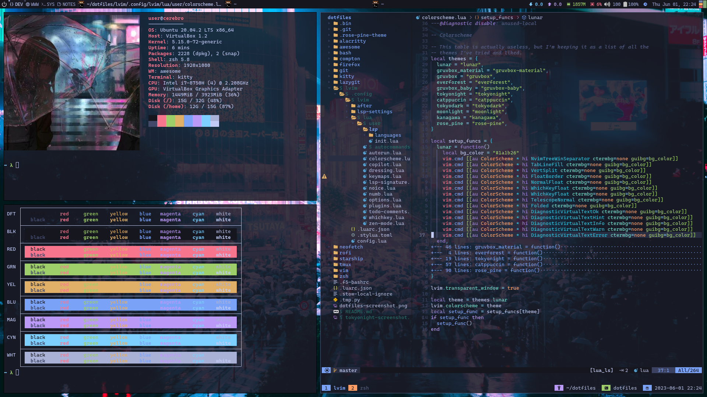

# dotfiles

[Tokyonight](https://github.com/sainnhe/gruvbox-material)


[Gruvbox Material](https://github.com/sainnhe/gruvbox-material)


## Installation

You will need [Git](https://git-scm.com/) and [GNU
Stow](https://www.gnu.org/software/stow/).

```sh
# On Arch
sudo pacman -S git stow

# On Ubuntu
sudo apt update
sudo apt-get install git stow

# On MacOS/OS X
brew install git stow
```

Clone into your `$HOME` or `~` directory:

```sh
git clone https://github.com/tnthi115/dotfiles.git
```

**Important:** Remove or backup your old config files before running `stow`.
For example:

```sh
mv ~/.zshrc ~/.zshrc.bak
```

Within `~/dotfiles/`, run `stow` to symlink everything or just select what you
want:

```sh
stow */ # Everything (the '/' grabs all directories and ignores files (e.g. README.md))
```

```sh
stow zsh # Just my zsh config
```

**Note:** `stow` doesn't assume `$HOME` (`~`) as the target directory, and instead
defaults to the parent of the current directory, which is why the above
commands work properly. If for some reason you want to clone to another
directory rather than your home directory (e.g. ~/repos/, ~/Git/, etc.), you
should run `stow` with the `--target` flag to specify your home directory:

```sh
stow --target=${HOME} zsh
```

## Dependencies

The following list is not comprehensive, but it lists what is important.

- neovim
  - lunarvim
- tmux
- git
  - lazygit
  - git-delta
- alacritty
- kitty
  - zsh
  - starship
  - neofetch
  - DT's colorscripts
- awesomewm
- rofi
- hardened firefox
  - tokyonight theme
  - gruvbox material theme
  - ublock origin
  - vimium
  - firefox multi-account containers
  - dark reader

## TODO

- [ ] add links
- [ ] flesh out dependencies more
