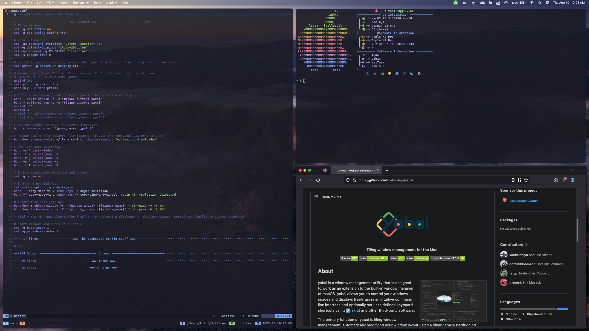
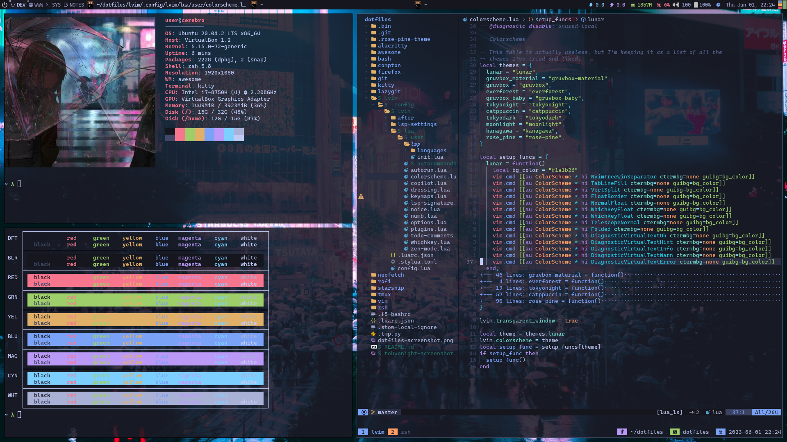
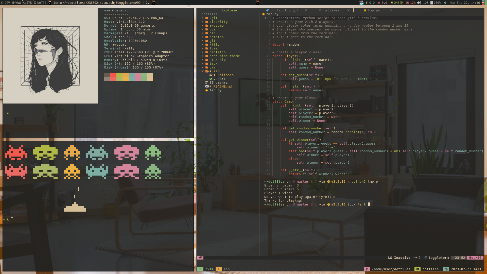

# dotfiles

This repository contains personal configuration files for a comprehensive
development environment. It manages configurations for over 40 tools across
macOS and Linux using GNU Stow for conflict-safe symlink deployment. The
environment is optimized for AI-first development with deep OpenCode
integration, specialized agent templates, and automated workflows.

## Screenshots

### TokyoNight




### Gruvbox Material



## Table of Contents

- [Quick Start](#quick-start)
- [What's Included](#whats-included)
- [Installation](#installation)
- [OpenCode Configuration](#opencode-configuration)
- [Key Tools](#key-tools)
- [Platform-Specific Tools](#platform-specific-tools)
- [Themes](#themes)

## Quick Start

1. Clone the repository to your home directory.

   ```sh
   git clone https://github.com/tnthi115/dotfiles.git ~/dotfiles
   ```

2. Install system dependencies using Homebrew (macOS) or pacman (Linux).
3. Backup any existing configuration files in your home directory.
4. Navigate to the repository and use GNU Stow to deploy configurations.

   ```sh
   cd ~/dotfiles
   stow nvim git tmux zsh
   ```

5. Install OpenCode Superpowers skills.

   ```sh
   ~/dotfiles/bin/install-superpowers.sh
   ```

## What's Included

| Category | Package | Description |
| :--- | :--- | :--- |
| Editors and IDEs | nvim | Neovim with LazyVim and extensive LSP support |
| Editors and IDEs | helix | Post-modern modal text editor |
| Editors and IDEs | vim | Classic Vim configuration |
| Editors and IDEs | vscode | Visual Studio Code settings and extensions |
| Editors and IDEs | zed | Modern high-performance editor |
| Editors and IDEs | jetbrains | JetBrains IDE configurations |
| Editors and IDEs | lvim | LunarVim legacy configuration |
| Terminal Emulators | ghostty | Fast GPU-accelerated terminal |
| Terminal Emulators | kitty | Cross-platform GPU terminal |
| Terminal Emulators | wezterm | Lua-configurable terminal multiplexer |
| Terminal Emulators | alacritty | Simple high-performance terminal |
| Shells | zsh | Zsh with Oh My Zsh and custom plugins |
| Shells | fish | Fish shell with smart autocompletion |
| Shells | bash | Standard Bash configuration |
| Shells | starship | Cross-shell customizable prompt |
| Terminal Multiplexer | tmux | Terminal multiplexer for session management |
| Terminal Multiplexer | sesh | Smart tmux session manager |
| Window Managers | yabai | macOS tiling window manager |
| Window Managers | skhd | macOS simple hotkey daemon |
| Window Managers | aerospace | i3-like window manager for macOS |
| Window Managers | amethyst | Automatic tiling window manager for macOS |
| Window Managers | awesome | Tiling window manager for Linux |
| Window Managers | rofi | Application launcher and menu |
| Window Managers | compton | X11 compositor for Linux |
| Git and Version Control | git | Global git configuration and delta integration |
| Git and Version Control | lazygit | Terminal UI for git |
| Git and Version Control | commitlint | Conventional commit enforcement |
| AI Development | opencode | OpenCode AI agent configuration |
| AI Development | mcphub | MCP server hub configuration |
| File Management | yazi | Terminal file manager with previews |
| CLI Tools | bat | Enhanced cat with syntax highlighting |
| CLI Tools | rumdl | Markdown linter and formatter |
| CLI Tools | prettier | Opinionated code formatter |
| CLI Tools | golangci-lint | Go linter runner |
| CLI Tools | ssh | SSH client configuration |
| Browser | firefox | Hardened Firefox with arkenfox user.js |
| Browser | browser-extensions | List of essential browser extensions |
| System | neofetch | System information display tool |
| System | bin | Custom utility scripts |
| System | KeyBindings | macOS system keybinding adjustments |
| System | kindavim | Vim-like input for macOS |
| System | via | Keyboard configuration for VIA-compatible boards |
| System | docs | Local documentation and references |

## Installation

### Prerequisites

You must have Git and GNU Stow installed on your system.

```sh
# macOS
brew install git stow

# Arch Linux
sudo pacman -S git stow

# Ubuntu
sudo apt update && sudo apt install git stow
```

### Dependency Management

Install platform-specific dependencies before stowing configurations.

```sh
# macOS
brew bundle --file=~/dotfiles/Brewfile

# Arch Linux
sudo pacman -S --needed - < pkglist.txt
```

### GNU Stow Deployment

Stow creates symlinks from the tool directories in `~/dotfiles/` to the parent
directory (usually `~/`).

```sh
# Deploy all configurations (not recommended for first run)
stow */

# Deploy specific tools
stow git nvim tmux ghostty
```

Stow defaults to the parent directory of the repository. If the repository is
cloned elsewhere (e.g., `~/repos/dotfiles`), use the target flag:

```sh
stow --target=${HOME} nvim
```

> **Warning**: Back up existing configuration files before running stow to prevent data loss.

## OpenCode Configuration

The development environment features an AI-first architecture powered by
OpenCode. This setup uses a three-layer approach: core orchestration,
specialized agents, and a persistent memory plugin.

### Directory Structure

```text
opencode/.config/opencode/
├── agents/
│   ├── commit.md
│   ├── docs-writer.md
│   └── review.md
├── command/
│   ├── analyze-project.md
│   ├── commit.md
│   ├── do.md
│   ├── plan.md
│   ├── review-code.md
│   ├── review-plan.md
│   └── serena.md
├── themes/
│   └── tymon-kanagawa.json
├── AGENTS.md
├── oh-my-opencode.jsonc
├── opencode.jsonc
├── tui.jsonc
└── README.md
```

### Sandbox Usage

For secure, standardized development, this configuration is compatible with the
OpenCode Sandbox. The sandbox runs OpenCode in a hardened Docker container
with restricted network access and approved providers only.

**Prerequisites**: Docker Desktop, `F5AI_API_KEY` environment variable.

1. **Symlink Setup**: The sandbox mounts `~/.local/opencode`. Create a symlink
   to your stow-managed config:

   ```bash
   ln -s ~/.config/opencode ~/.local/opencode
   ```

2. **Launch**: Run the sandbox from any project directory:

   ```bash
   # Example using the python-flavor sandbox
   ~/path/to/opencode-sandbox/bin/run.sh python --name my-dev-session
   ```

**Capability Matrix**:

- **YES**: Custom Agents, Commands, Superpowers Skills.
- **NO**: External MCP Servers (disabled for sandbox), Internet-phoning plugins.

### Plugins

- **oh-my-opencode**: Orchestration framework for multi-agent workflows.
- **opencode-notify**: System notifications for agent status and task
  completion.
- **opencode-agent-memory**: Persistent memory blocks for long-term project
  context.

### MCP Servers

| Server | Purpose | Status |
| :--- | :--- | :--- |
| git | Repository state analysis and operations | Disabled |
| sequential-thinking | Advanced reasoning and problem-solving | Disabled |
| atlassian | Jira and Confluence integration | Disabled |
| context7 | External library documentation search | Disabled (Sandbox) |
| websearch | exa.ai web search integration | Disabled (Sandbox) |
| grep_app | grep.app code search integration | Disabled (Sandbox) |

### Custom Agents

| Name | Purpose | Invocation |
| :--- | :--- | :--- |
| @commit | Analyzes staged changes for conventional commits | `opencode agent commit` |
| @docs-writer | Generates and maintains project documentation | `opencode agent docs-writer` |
| @review | Performs combined correctness and quality code review | `opencode agent review` |

### Custom Commands

- **/analyze-project**: Initial codebase analysis and indexing.
- **/plan**: Technical implementation plan generation.
- **/do**: Automated execution of a generated plan.
- **/review-code**: Review code changes on the current branch.
- **/review-plan**: Review an implementation plan via Momus.
- **/commit**: Stages and commits changes with AI-generated messages.
- **/serena**: Manual context optimization.

### Workflow

The system supports two primary operational patterns:

1. **Ultrawork Mode**: Use `ulw <task>` for direct, autonomous execution of a
   specific task.
2. **Planned Execution**: Use `@prometheus <task>` to trigger an
   interview-driven planning phase, followed by `/start-work` for orchestrated
   implementation.

Refer to the [orchestration guide](https://github.com/code-yeongyu/oh-my-opencode/blob/dev/docs/guide/orchestration.md#tldr---when-to-use-what) for detailed workflow selection.

### Agent Model Assignments

| Agent | Model | Role |
| :--- | :--- | :--- |
| sisyphus | claude-opus-4-6 | Main orchestrator |
| prometheus | claude-opus-4-6 | Strategic planner |
| metis | claude-opus-4-6 | Plan gap analyzer |
| oracle | gpt-5.4 | Architecture consultant |
| momus | gpt-5.4 | Ruthless reviewer |
| hephaestus | gpt-5.3-codex | Autonomous deep worker |
| sisyphus-junior | claude-sonnet-4-6 | Focused task executor |
| librarian | gemini-3-flash-preview | Lightweight doc search |
| explore | grok-code-fast-1 | Fast codebase grep |
| multimodal-looker | gpt-5.4 | Image/document analysis |
| atlas | claude-sonnet-4-6 | Todo orchestration |

### Category Model Assignments

| Category | Model | Purpose |
| :--- | :--- | :--- |
| visual-engineering | gemini-3-pro-preview | Frontend/UI development |
| ultrabrain | gpt-5.4 | Maximum reasoning capability |
| deep | gpt-5.3-codex | Complex problem-solving |
| quick | claude-haiku-4-5 | Trivial or repetitive tasks |
| writing | gemini-3-flash-preview | Documentation and prose |
| artistry | gemini-3-pro-preview | Creative and novel approaches |
| unspecified-high | claude-opus-4-6 | General complex work |
| unspecified-low | claude-sonnet-4-6 | General standard work |

### Superpowers Skills

Superpowers is a skill framework that enforces engineering discipline through
structured workflows.

**Installation**:

```sh
~/dotfiles/bin/install-superpowers.sh
```

**Key Skills**:

- Test-Driven Development (TDD)
- Systematic debugging
- Writing and executing plans
- Verification before completion
- Brainstorming and code review
- Git worktree management
- Dispatching parallel agents

### Lazygit Integration

The script `lazygit/bin/reword-commit-with-opencode.sh` is integrated into
Lazygit to allow AI-powered rewriting of commit messages. It analyzes the git
diff and generates a contextually accurate conventional commit message.

### LSP and Formatters

| Language/Format | LSP Server | Formatter |
| :--- | :--- | :--- |
| Markdown | rumdl | rumdl |
| Python | basedpyright | ruff |
| Lua | - | stylua |
| Shell | fish-lsp | shfmt |
| TOML | taplo | taplo |
| Go | golangci-lint-langserver | goimports |
| Rust | rust-analyzer | - |
| YAML | yaml-language-server | - |
| Docker | docker-langserver | - |
| JSON/JSONC | - | - |

A more detailed guide is available at `opencode/.config/opencode/README.md`.

## Key Tools

### Neovim (LazyVim)

The primary text editor is Neovim, configured with LazyVim. It provides a robust
IDE-like experience with pre-configured LSP, treesitter, and debugging support.

### Tmux

Tmux is used for session management, allowing persistent development
environments that survive terminal closures. It integrates with sesh for smart
session switching.

### Ghostty

Ghostty is a modern, GPU-accelerated terminal emulator written in Zig. It offers
high performance, native features, and excellent font rendering.

### Fish Shell

Fish is the default interactive shell, providing web-based configuration,
excellent autosuggestions, and clean syntax.

### Modern CLI Replacements

| Original | Replacement | Purpose |
| :--- | :--- | :--- |
| cat | bat | Syntax highlighting and git integration |
| ls | lsd | Icons and color-coded output |
| cd | zoxide | Frecency-based directory jumping |
| find | fd | Faster and more intuitive searching |
| grep | ripgrep (rg) | Blazingly fast content search |
| - | fzf | General purpose fuzzy finder |

## Platform-Specific Tools

<details>
<summary>macOS</summary>

- **Raycast**: A fast, extensible replacement for Spotlight.
- **Yabai**: A tiling window manager that provides binary space partitioning.
- **SKHD**: A simple hotkey daemon used to control Yabai.
- **Aerospace**: An alternative i3-like tiling window manager that does not
  require SIP modifications.

</details>

<details>
<summary>Linux</summary>

- **AwesomeWM**: A highly customizable window manager configured with Lua.
- **Rofi**: An application launcher and window switcher.
- **Picom/Compton**: Compositors for transparency and window effects.

</details>

## Themes

The repository maintains strict visual consistency using TokyoNight and Gruvbox
Material themes. These themes are synchronized across all supported
applications, including editors, terminals, shells, and browser interfaces.
