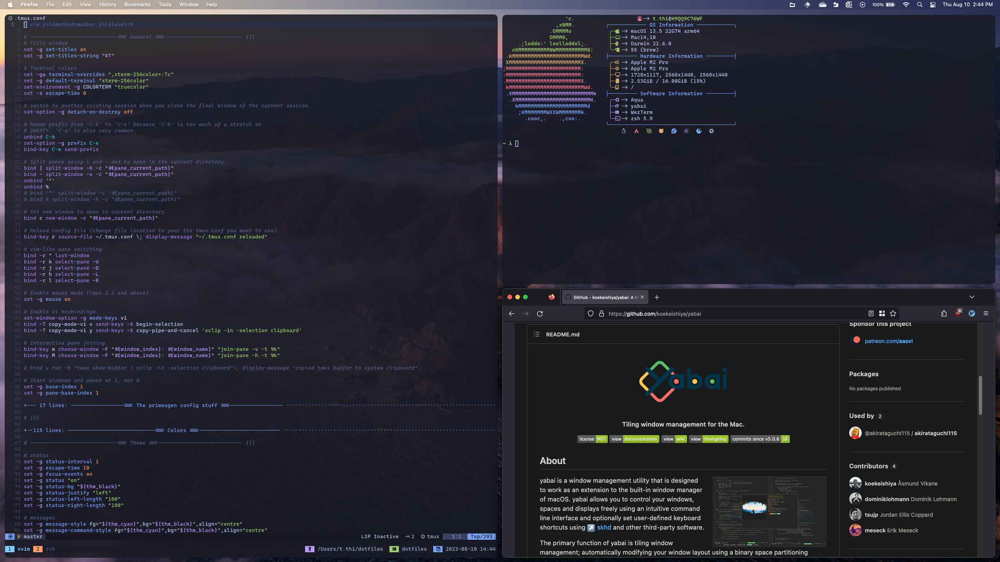

# dotfiles

These are my personal configuration files.

[Tokyonight](https://github.com/folke/tokyonight.nvim)



[Gruvbox Material](https://github.com/sainnhe/gruvbox-material)


## Installation

> **Warning**: I am not responsible for any changes to your system. Make sure
> you understand what you are doing before installing any dependencies and
> using my dotfiles.

Make sure to install the [dependencies](#dependencies) listed below.

```sh
# On Arch (pkglist.txt is a WIP and not complete)
sudo pacman -S --needed - < pkglist.txt

# On MacOS
brew bundle --file=~/dotfiles/Brewfile
```

> **Warning**: The package names may vary or some may not exist depending on your
> package manager. If so, just look up how to install the packages on your
> system.

You will need [Git](https://git-scm.com/) and [GNU
Stow](https://www.gnu.org/software/stow/) to clone and symlink the dotfiles.

```sh
# On Arch
sudo pacman -S git stow

# On Ubuntu
sudo apt update
sudo apt-get install git stow

# On MacOS/OS X
brew install git stow
```

Clone into your `$HOME` or `~` directory:

```sh
git clone https://github.com/tnthi115/dotfiles.git
```

> **Important:** Remove or backup your old config files before running `stow`.
> For example:

```sh
mv ~/.zshrc ~/.zshrc.bak
```

Within `~/dotfiles/`, run `stow` to symlink everything (not recommended) or
just select what you want:

```sh
stow */ # Everything (the '/' grabs all directories and ignores files (e.g. README.md))
```

```sh
stow zsh # Just my zsh config
```

> **Note:** `stow` doesn't assume `$HOME` (`~`) as the target directory, and instead
> defaults to the parent of the current directory, which is why the above
> commands work properly. If for some reason you want to clone to another
> directory rather than your home directory (e.g. ~/repos/, ~/Git/, etc.), you
> should run `stow` with the `--target` flag to specify your home directory:

```sh
stow --target=${HOME} zsh
```

## Dependencies

The following list is not comprehensive, but it includes what is important. It
is broken down by OS:

- [Shared](#shared) (across all OSes)
- [Linux](#linux)
- [MacOS](#macos)

### Shared

#### Fonts

Install a [Nerd Font](https://www.nerdfonts.com/font-downloads). My current
favorites are [CaskaydiaCove Nerd
Font](https://github.com/ryanoasis/nerd-fonts/releases/download/v3.0.1/CascadiaCode.zip)
and [Hack Nerd
Font](https://github.com/ryanoasis/nerd-fonts/releases/download/v3.0.1/Hack.zip).

#### Wallpapers

You can clone my wallpapers [repo](https://github.com/tnthi115/wallpapers) if
you want to use the same collections I've created.

#### Neovim

I used to use [Lunarvim](https://www.lunarvim.org/) as a base config for
[neovim](https://neovim.io/). Now I prefer
[LazyVim](https://github.com/tnthi115/lazyvim).

#### Tmux

I use [tmux](https://github.com/tmux/tmux) for "sessionizing" different
projects so that I can quickly context switch without overhead and easily pick
up where I left off.

#### Lazygit

[Lazygit](https://github.com/jesseduffield/lazygit) is super convenient and can
be launched within neovim, but learn how to use `git` on the command line
first! `Lazygit` should be used a time saving tool, not a crutch.
[Delta](https://github.com/dandavison/delta) makes diffs prettier.

#### OpenCode

[OpenCode](https://opencode.ai/) is an AI coding assistant with multi-agent
orchestration. My configuration uses:

- **[oh-my-opencode](https://github.com/code-yeongyu/oh-my-opencode)**: Plugin
  providing specialized agents (Sisyphus, Oracle, Prometheus), parallel
  execution, and ultrawork mode
- **[superpowers](https://github.com/obra/superpowers)**: Skills framework
  enforcing TDD, systematic debugging, and planning discipline

Install superpowers after stowing opencode config:

```sh
~/dotfiles/bin/install-superpowers.sh
```

#### Kitty

[Kitty](https://sw.kovidgoyal.net/kitty/) supports ligatures, so I like it over
[alacritty](https://github.com/alacritty/alacritty) for now.
[Fzf](https://github.com/junegunn/fzf) is a must have as well.

#### Wezterm

[Wezterm](https://github.com/wez/wezterm) is another GPU accelerated terminal
written in Rust (btw) that also supports ligatures and is configured in Lua
(like Neovim, which is fun). Currently, I'm actually liking this better than
Kitty because the newest versions of Kitty are giving me issues with fonts
rendering in all bold for whatever reason.

#### Ghostty

[Ghostty](https://ghostty.org/), written by Mitchell Hashimoto, is the new kid
on the block. You can read about the features
[here](https://ghostty.org/docs/features).

#### Zsh

I like to use [zsh](https://wiki.archlinux.org/title/zsh) over
[bash](https://wiki.archlinux.org/title/bash) because of two plugins:

- [zsh-autosuggestions](https://github.com/zsh-users/zsh-autosuggestions)
- [zsh-syntax-highlighting](https://github.com/zsh-users/zsh-syntax-highlighting)

I use [starship](https://starship.rs/) for my prompt. For some bling, I run
[neofetch](https://github.com/dylanaraps/neofetch) and [DT's
colorscripts](https://gitlab.com/dwt1/shell-color-scripts) in my `.zshrc`.

#### Firefox

Use the [Arkenfox user.js](https://github.com/arkenfox/user.js) to harden. [Librewolf](https://librewolf.net/)
and [Brave](https://brave.com/) are okay alternatives.

#### Extensions

- [Tokyo Night by Milav](https://addons.mozilla.org/en-US/firefox/addon/tokyo-night-milav/?utm_source=addons.mozilla.org&utm_medium=referral&utm_content=search)
- [Gruvbox Material Dark by akay](https://addons.mozilla.org/en-US/firefox/addon/gruvbox-material-dark/?utm_source=addons.mozilla.org&utm_medium=referral&utm_content=search)
- simple tab groups
- ublock origin in medium mode
- vimium
- firefox multi-account containers
- dark reader

### Linux

#### Awesomewm

I use [awesomewm](https://awesomewm.org/) for my tiling window manager. It has
a built in application launcher, but you can use
[rofi](https://github.com/davatorium/rofi) universally.
[Compton](https://github.com/chjj/compton) is preinstalled on Ubuntu. Use
[picom](https://github.com/yshui/picom) on Arch.

I will probably switch to bspwm or qtile in the future.

### MacOS

#### Raycast

[Raycast](https://www.raycast.com/) is an blazingly fast, batteries-included
run launcher for MacOS only (unfortunately). I really enjoy its extensibility
and the workflow it allows me to have, especially combined with
[Yabai](#yabai).

#### Yabai

[Yabai](https://github.com/koekeishiya/yabai) is a tiling window manager for
MacOS, with very similar architecture to
[bspwm](https://github.com/baskerville/bspwm) +
[sxhkd](https://github.com/baskerville/sxhkd) on Linux and
[komorebi](https://github.com/LGUG2Z/komorebi) +
[whkd](https://github.com/LGUG2Z/whkd) on Windows.

#### Keybindings

> **Note**: I don't use this anymore.

- [Change MacOS Keybindings](https://blog.victormendonca.com/2020/04/27/how-to-change-macos-key-bindings/)
  to bind ctrl + left and ctrl + right to move one word at a time:

```sh
stow KeyBindings
```

- Remap mission control to alt + up in keyboard shortcut settings
  - Remap space swapping to alt + {1,2,3,4}

## TODO

- [x] add links
- [ ] flesh out dependencies more
- [x] add brew packages file
- [x] maybe organize directories into shared, macos, linux
- [ ] add section on `yazi` and other tools I haven't added
